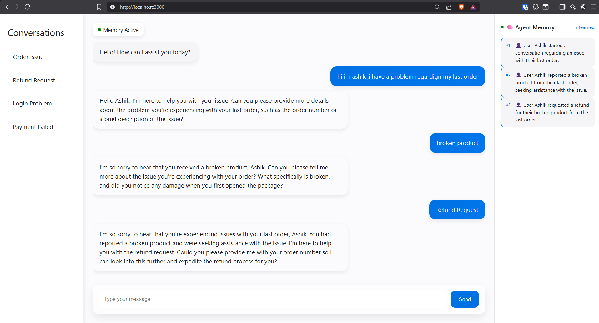
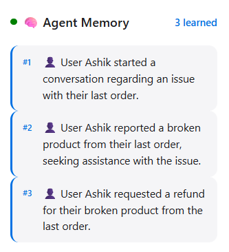

# 🎧 Echo Support

> An AI-powered customer support chatbot with persistent memory — built with Python, Groq (LLaMA 3.3 70B), and vanilla JavaScript.


---

## 📌 Overview

**Echo Support** is a smart customer support chatbot that **remembers users across sessions**. Powered by **Groq's LLaMA 3.3 70B** and a custom memory layer via **Hindsight**, Echo doesn't just answer questions — it learns from every conversation and delivers a personalized experience every time a user returns.

---

## ✨ Features

- 🧠 **Persistent Memory** — Automatically extracts and stores facts from conversations  
- 👋 **Personalized Welcome** — Greets returning users based on stored memory  
- ⚡ **Groq-Powered AI** — Ultra-fast responses using LLaMA 3.3 70B  
- 🔗 **Hindsight Integration** — Context-aware memory retrieval  
- 💬 **Typing Animation** — Character-by-character response rendering  
- 📋 **Live Memory Panel** — Displays learned user facts in real time  
- 🗂️ **Chat History** — Automatically persists conversations  
- 🔄 **Memory Reset** — Clear all stored data instantly  
- 🎨 **Clean UI** — Built with pure HTML, CSS, and JavaScript  

---

## 📸 Preview

###Chat UI


###Memory panel


---

## 🗂️ Project Structure

echo-support/
├── backend/
│   ├── app.py                    
│   ├── hindsight_integration.py  
│   ├── memories.json             
│   └── .env                      
├── frontend/
│   ├── index.html                
│   ├── script.js                 
│   └── style.css                 
├── .gitignore
└── README.md

---

## 🚀 Getting Started

### Prerequisites

- Python 3.10+
- Groq API Key → https://console.groq.com/

---

### 1. Clone the Repository

```bash
git clone https://github.com/ashik-ongit/echo-support.git
cd echo-support
```

---

### 2. Install Dependencies

```bash
cd backend
pip install -r requirements.txt
```

---

### 3. Configure Environment Variables

Create a `.env` file inside the `backend/` folder:

```env
GROQ_API_KEY=your_groq_api_key_here
```

---

### 4. Run the Backend

```bash
python app.py
```

Server runs at: http://localhost:5000

---

### 5. Run the Frontend

```bash
cd frontend
python -m http.server 3000
```

Open in browser: http://localhost:3000

---

## 🔌 API Reference

| Method | Endpoint   | Description |
|--------|------------|-------------|
| POST   | /chat      | Send a message and receive AI reply |
| GET    | /welcome   | Get personalized welcome message |
| GET    | /memories  | Retrieve stored memory |
| GET    | /history   | Get full conversation history |
| POST   | /reset     | Clear memory and history |

---

## 📦 Example API Usage

### POST /chat

**Request**
```json
{
  "message": "Hi, my name is Ashik"
}
```

**Response**
```json
{
  "reply": "Nice to meet you, Ashik!"
}
```

---

## 🧠 How Memory Works

1. User sends a message  
2. AI generates a response  
3. A memory fact is extracted  
4. Fact is saved to `memories.json`  
5. On future chats → memory is injected into the prompt  
6. Responses become personalized  

---

## 🛠️ Tech Stack

| Layer        | Technology |
|-------------|-----------|
| Backend     | Python, Flask, Flask-CORS |
| AI Model    | Groq API — LLaMA 3.3 70B |
| Memory      | Hindsight + JSON storage |
| Frontend    | HTML5, CSS3, JavaScript |
| Config      | python-dotenv |

---

## 🌐 Deployment (Optional)

- Backend: Render / Railway / Docker  
- Frontend: Netlify / GitHub Pages  

---

## 🤝 Contributing

```bash
git checkout -b feature/your-feature-name
git commit -m "Add: your feature description"
git push origin feature/your-feature-name
```

---

## 📄 License

This project is licensed under the MIT License.

---

## 👨‍💻 Author

Built by https://github.com/ashik-ongit and team 
